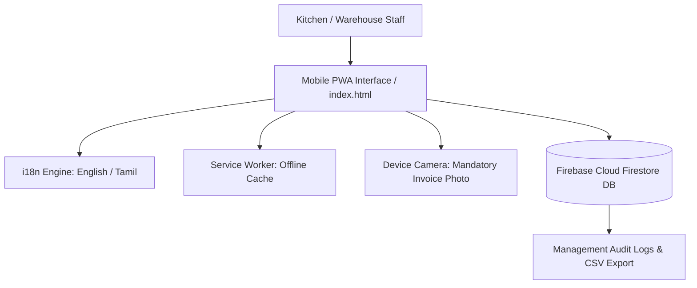

# Sree Ambal Catering: Multilingual Mobile Inventory & Security PWA 🍲📱

<div align="center">

[](https://web.dev/progressive-web-apps/)
[](https://firebase.google.com/)
[](https://developer.mozilla.org/en-US/docs/Web/JavaScript)
[](#)
[](#)

**Ultra-Minimal, Lightning-Fast Mobile Inventory & Security Audit Portal for Sree Ambal Catering.**

</div>

---

## 📖 Overview

**Sree Ambal Catering Inventory Portal** is a production-grade Progressive Web App (PWA) engineered by **A Generative Slice** for **Sree Ambal Catering** (one of the region's prominent traditional catering and wedding banquet operations).

In high-pressure commercial catering, tracking raw ingredient logistics (spices, grains, ghee, packaging) across procurement, storehouse, and wedding hall event sites is critical. This portal eliminates inventory shrinkage through batch cart transactions, bilingual staff interfaces (English & Tamil), and mandatory camera photo verification for all delivery invoices and gate-pass security checks.

---

## 🌟 Key Features

- 🌐 **Bilingual English & Tamil Support (`i18n.js`)**: Instant single-tap language switching ensuring kitchen supervisors and warehouse staff can operate fluently in Tamil or English.
- 📦 **200+ South Indian Catering Catalog (`catalog.js`)**: Pre-calibrated catalog covering provisions, dairy, dry fruits, spices, vegetables, containers, and gas cylinders.
- 🛒 **Batch Cart Stock Check-In & Check-Out**: Fast multi-item selection with quantity adjustments, unit conversions (kg, grams, liters, tins, bags), and inward/outward tagging.
- 📸 **Mandatory Security Photo Audit**: Enforces live camera photo capture of paper supplier invoices or loaded transport vehicles before confirming transactions (`cartPhotoDataUrl`).
- 📶 **Offline PWA Reliability (`sw.js`)**: Full Service Worker caching enabling warehouse staff to record entries in cold storage basements without internet connectivity; syncs automatically once reconnected.
- 👥 **Role-Based Access Control**: Granular access levels for Staff, Kitchen In-Charge, Security Gate, and Managing Partners.
- 📑 **Instant CSV Export**: Exports date-range transaction records directly to Excel/CSV for accounting reconciliation.

---

## 🛠️ Architecture & Tech Stack



- **Frontend**: Semantic HTML5, Vanilla JavaScript (Modular ES6+), Modern Mobile CSS.
- **Backend Database**: Google Cloud Firestore (Firebase Web Compat SDK).
- **Offline & Native Capabilities**: PWA Web App Manifest (`manifest.json`), Cache-First Service Worker (`sw.js`).
- **Typography**: Google Fonts Inter and Outfit.

---

## 📂 Repository Structure

```
sree-ambal-inventory/
├── index.html              # Core single-page mobile interface & modals
├── app.js                  # Application state, cart operations & Firestore bindings
├── catalog.js              # 200+ ingredient items, units, and category groupings
├── i18n.js                 # Complete bilingual English / Tamil translation dictionary
├── style.css               # Ultra-responsive mobile UI and touch styles
├── manifest.json           # Progressive Web App manifest
├── sw.js                   # Service Worker offline caching strategy
├── .nojekyll               # Disables Jekyll processing for GitHub Pages
└── README.md               # Project documentation
```

---

## 🚀 Running Locally

This application requires zero build steps and runs out-of-the-box on any browser:

```bash
# 1. Clone repository
git clone https://github.com/A-Generative-Slice/sree-ambal-inventory.git
cd sree-ambal-inventory

# 2. Serve locally
npx serve .
# or
python -m http.server 3000
```

Open `http://localhost:3000` on your mobile browser or desktop. To install as an app on your mobile device, tap **Add to Home Screen**.

---

## 📄 License & Attribution

Designed and engineered by **A Generative Slice** for **Sree Ambal Catering**.  
Copyright © 2026 Sree Ambal Catering & A Generative Slice. All rights reserved.
